# ВКР (рабочая версия с новой структурой)

**Тема:** Разработка программного обеспечения для автоматизации процессов планирования и работы сети автомобильных сервисных центров (веб-приложение)

---

## Введение

Рынок технического обслуживания автомобилей развивается в условиях высокой конкуренции, роста клиентских ожиданий и усложнения внутренних операций. Для сети сервисных центров ключевой проблемой становится не выполнение отдельных ремонтов, а управляемость процесса в целом: запись клиентов, контроль загрузки филиалов, соблюдение сроков, прозрачность статусов и согласованность работы персонала.

В реальных условиях работы автосервисной сети проблемы управления особенно заметны при росте числа филиалов и расширении перечня услуг. Чем больше в системе участников — клиентов, администраторов, мастеров, руководителей, — тем выше требования к скорости обмена информацией, точности планирования и согласованности действий. При отсутствии единой цифровой среды даже незначительные организационные сбои приводят к накоплению ошибок: пересечению записей, потере части клиентской истории, задержкам в обслуживании и снижению качества коммуникации.

Дополнительную сложность создает необходимость одновременно решать задачи разных уровней. На операционном уровне требуется обеспечить удобную онлайн-запись, корректную работу расписания, контроль статусов обслуживания и оплаты. На управленческом уровне важны прозрачность загрузки филиалов, сопоставимость показателей, возможность быстро вносить изменения в справочники услуг, графики работы и правила взаимодействия с клиентами. Следовательно, проектирование подобной системы не может ограничиваться созданием отдельных экранов или форм: необходима целостная архитектура, учитывающая процессы, роли, ограничения и перспективы дальнейшего расширения.

В проекте AutoService эта задача решается через единую цифровую платформу, которая объединяет пользовательский веб-интерфейс, административный раздел, REST API, платежный модуль, уведомления и программу лояльности. Такой подход позволяет не только автоматизировать базовые сценарии обслуживания, но и сформировать технологическую основу для дальнейшего масштабирования решения, интеграции с внешними сервисами и накопления эксплуатационной аналитики. ВКР ориентирована не только на описание результата, но и на демонстрацию инженерных решений: выбор архитектуры, формализация требований, реализация бизнес-логики, обеспечение безопасности и проверка качества.

Актуальность темы определяется тем, что цифровизация сервисных процессов в автомобильной отрасли становится не вспомогательной, а стратегической задачей. Пользователь ожидает возможности быстро записаться на обслуживание, заранее понимать стоимость и статус работ, получать уведомления и управлять своими данными без лишних звонков и визитов. Организация, в свою очередь, заинтересована в снижении доли ручных операций, повышении предсказуемости загрузки и формировании единого источника достоверной информации по всем ключевым процессам. Поэтому разработка специализированного веб-приложения для автоматизации сети автомобильных сервисных центров является практически значимой и методически обоснованной задачей.

**Цель работы** — разработать и обосновать веб-приложение для автоматизации планирования и операционной работы сети автомобильных сервисных центров.

**Задачи работы:**
1. Проанализировать предметную область и проблемы текущей организации процессов.
2. Определить функциональные, нефункциональные требования и ограничения.
3. Спроектировать архитектуру и модель взаимодействия компонентов.
4. Реализовать пользовательские и административные сценарии.
5. Реализовать API и интеграции (оплата, уведомления, лояльность).
6. Выполнить тестирование и оценить эксплуатационную применимость.

---

## 1 Теоретическая часть (материалы и методы)

### 1.1 Анализ предметной области

#### 1.1.1 Описание предметной области и проблемы

Сеть автосервисов — динамическая система с множеством параллельных процессов: прием заявок, формирование расписания, обслуживание автомобилей, управление филиалами и персоналом, коммуникация с клиентами. При росте количества обращений ручная координация (звонки, таблицы, локальные записи) приводит к конфликтам слотов, задержкам и потере данных.

Предметная область включает несколько тесно связанных групп сущностей и процессов. С одной стороны, это клиентский слой: учет пользователей, история их обращений, сведения об автомобилях, выбор услуги, даты и времени посещения, отслеживание статуса записи и оплаты. С другой стороны, это внутренняя операционная деятельность организации: управление филиалами, настройка графиков, распределение нагрузки, администрирование перечня услуг, обработка отзывов и контроль показателей работы. Эффективность системы в такой области определяется не только полнотой отдельных функций, но и согласованностью взаимодействия между ними.

Особенность сетевого автосервиса состоит в том, что каждая ошибка планирования влияет сразу на несколько участников процесса. Неверно рассчитанный слот времени создает проблемы не только для одного клиента, но и для мастера, администратора, следующей записи и, в конечном счете, для репутации филиала. Аналогично, отсутствие актуальной информации по статусу обслуживания или оплате снижает прозрачность сервиса и увеличивает нагрузку на сотрудников, вынужденных вручную уточнять данные. Это делает автоматизацию не вопросом удобства, а необходимым условием устойчивой операционной деятельности.

Ручные и частично автоматизированные подходы, характерные для небольших сервисных организаций, плохо масштабируются при переходе к филиальной модели. Если данные о клиентах, расписании и услугах распределены между несколькими каналами и инструментами, организация теряет единое представление о своей загрузке и качестве сервиса. Возникают сложности с анализом спроса, сопоставлением показателей между филиалами и контролем исполнения регламентов. Следовательно, для рассматриваемой предметной области требуется система, которая обеспечивает централизацию данных, формализацию правил и снижение доли неструктурированных ручных действий.

Критичные проблемы:
- фрагментация данных между каналами;
- низкая предсказуемость календаря;
- высокая зависимость от ручных операций;
- ограниченная прозрачность статусов для клиента;
- слабая управленческая аналитика по филиалам.

Перечисленные проблемы напрямую влияют на основные показатели эффективности. Фрагментация данных осложняет сопровождение клиента и ведет к ошибкам при повторных обращениях. Низкая предсказуемость календаря мешает рационально использовать рабочее время персонала и снижает пропускную способность филиала. Высокая зависимость от ручных операций увеличивает риск человеческого фактора, а недостаточная прозрачность статусов ухудшает клиентский опыт. Наконец, слабая аналитическая база затрудняет принятие управленческих решений, поскольку руководство не получает своевременной и сопоставимой картины загрузки и качества обслуживания.

#### 1.1.2 Теоретические подходы

Для решения задачи применены подходы, позволяющие рассматривать разрабатываемое решение не как набор изолированных функций, а как согласованную информационную систему. Выбор методов обусловлен спецификой предметной области: большим количеством бизнес-правил, необходимостью разграничения ролей, высокой ценой ошибок в расписании и потребностью в дальнейшем масштабировании.

- **системный анализ** — для описания процессов сети как единой управляемой системы;
- **клиент-серверный подход** — для централизации бизнес-правил;
- **доменная декомпозиция** — для разделения ответственности между модулями;
- **API-first мышление** — для повторного использования бизнес-функций разными клиентами;
- **валидация на нескольких уровнях** (сериализатор, форма, БД) — для защиты целостности данных.

Системный анализ позволяет представить деятельность автосервисной сети как совокупность взаимосвязанных процессов с входами, ограничениями, управляющими воздействиями и измеримыми результатами. Такой взгляд особенно важен при проектировании цифрового решения, поскольку дает возможность выделить критические точки управления: формирование расписания, изменение статусов обслуживания, контроль доступности слотов, обработку платежных событий и сбор обратной связи. Благодаря этому требования к системе формируются не абстрактно, а на основе реальных взаимосвязей между участниками и этапами обслуживания.

Клиент-серверная модель выбрана как базовая архитектурная основа, поскольку она обеспечивает централизованное хранение данных и единое выполнение бизнес-логики. В рассматриваемой предметной области это особенно важно: правила доступности записи, ограничения по времени, сценарии оплаты и проверки прав доступа должны выполняться одинаково независимо от того, обращается ли пользователь через веб-интерфейс или через API. Централизация логики уменьшает риск расхождения поведения системы в разных точках доступа и упрощает сопровождение решения.

Доменная декомпозиция применяется для структурирования системы по предметным подсистемам: клиентская работа с автомобилями и записями, административное управление, платежи, уведомления, программа лояльности. Такой подход повышает читаемость архитектуры, локализует изменения и облегчает развитие проекта. Отдельно важно API-first мышление, поскольку оно задает проектирование функциональности через устойчивые контракты взаимодействия. Это позволяет использовать одну и ту же бизнес-логику в разных пользовательских сценариях и создает основу для подключения внешних клиентов или мобильного приложения в будущем.

Отдельное значение имеет многоуровневая валидация данных. В условиях, когда система обрабатывает расписание, персональные данные, платежные статусы и связи между сущностями, недостаточно проверять корректность входных данных только на уровне интерфейса. Поэтому контроль осуществляется на нескольких слоях: в формах и сериализаторах, в прикладной логике и на уровне базы данных. Такой подход уменьшает вероятность появления неконсистентных состояний и повышает надежность системы в условиях многопользовательской эксплуатации.

#### 1.1.3 Обзор аналогов

При анализе существующих решений можно выделить несколько групп аналогов. Первая группа — универсальные SaaS-сервисы для онлайн-записи, ориентированные на широкий круг услуг: от медицины и салонов красоты до небольших сервисных предприятий. Их преимущество заключается в быстром запуске и наличии типовых функций: регистрация клиентов, базовый календарь, напоминания и учет услуг. Однако такие системы, как правило, слабо учитывают особенности филиальной структуры, сложные сценарии обслуживания и необходимость тесной интеграции с внутренними процессами конкретной организации.

Вторая группа — специализированные корпоративные системы автоматизации, которые могут включать управление заказ-нарядами, складом, CRM-элементы и отчетность. Их сильная сторона — функциональная насыщенность, но на практике такие решения часто оказываются избыточными для учебного проекта и требуют значительных ресурсов на внедрение, настройку и сопровождение. Кроме того, закрытая архитектура или ограниченные возможности модификации мешают гибко адаптировать систему под собственную модель данных, логику ролей и нестандартные правила взаимодействия с клиентами.

Для задач данной ВКР существенным критерием выбора является не только наличие функций записи, но и возможность последовательно наращивать систему как инженерный продукт. Необходимо учитывать поддержку ролевой модели, расширение API, интеграцию с платежным провайдером, внедрение механик лояльности и развитие аналитических инструментов. Многие готовые решения хорошо закрывают один или несколько таких аспектов, но редко обеспечивают полный контроль над архитектурой, качеством кода и логикой развития проекта.

Поэтому в рамках ВКР выбран путь разработки собственного решения, где архитектура, модель данных и набор модулей полностью контролируются командой разработки и могут эволюционировать под реальные процессы сети автосервисов. Такой выбор оправдан как с практической, так и с исследовательской точки зрения: он позволяет не только создать рабочее приложение, но и продемонстрировать полный цикл инженерного проектирования — от анализа предметной области и выбора подходов до реализации, тестирования и оценки применимости системы.

### 1.2 Требования к системе

#### 1.2.1 Функциональные требования

Функциональные требования определяют прикладные возможности системы, необходимые для поддержки полного цикла взаимодействия клиента с сервисным центром и для ежедневной операционной работы персонала. В рамках ВКР функциональность формируется таким образом, чтобы покрыть как пользовательские сценарии (запись, отслеживание, оплата), так и административные процессы (управление справочниками, расписанием, качеством сервиса). Это позволяет рассматривать систему не как отдельный модуль записи, а как единую платформу управления сервисными процессами.

Система должна обеспечивать:
1. регистрацию, авторизацию и управление профилем пользователя, включая хранение персональных данных в пределах ролевых прав доступа;
2. ведение карточек автомобилей (бренд, модель, VIN, номер) с возможностью использования истории записей на обслуживание и статусов этих записей в последующих обращениях;
3. онлайн-запись с выбором филиала, услуги, даты и времени на основе проверяемых правил доступности;
4. контроль статуса записи и оплаты на всех ключевых этапах обслуживания, включая актуализацию состояния после внешних событий;
5. административное управление филиалами, услугами, расписанием, сотрудниками и связанными параметрами, влияющими на планирование;
6. обработку отзывов и базовую операционную аналитику для оценки качества обслуживания и загрузки сети;
7. API-интерфейс для клиентских и административных сценариев с едиными бизнес-правилами и предсказуемыми контрактами.

Функциональные требования также предполагают согласованность действий между подсистемами. Например, изменение состава услуг и графиков филиала должно автоматически отражаться в доступности слотов записи, а события оплаты — в статусах заявок и пользовательском интерфейсе. В текущей версии платежная функциональность реализована через интеграцию с YooKassa, что обеспечивает единый и предсказуемый сценарий онлайн-оплаты в клиентских и административных процессах. Таким образом, ценность функциональной части определяется не только наличием отдельных операций, но и корректной связью между ними в рамках единого процесса обслуживания.

#### 1.2.2 Нефункциональные требования

Нефункциональные требования задают качественные характеристики системы и определяют условия, при которых реализованная функциональность может использоваться в реальной эксплуатации. Для рассматриваемой предметной области они критичны, поскольку система работает с персональными данными, расписанием, платежными событиями и управленческими метриками. Нарушение нефункциональных требований, даже при наличии всех заявленных функций, приводит к снижению доверия пользователей и росту операционных рисков.

- безопасность: JWT-аутентификация, разграничение доступа по ролям и защита критичных операций от несанкционированного изменения;
- надежность: валидация входных данных, контроль переходов состояний и предотвращение некорректных или противоречивых записей;
- производительность: приемлемое время отклика в массовых сценариях клиентской записи и административной обработки данных;
- масштабируемость: возможность расширения на новые филиалы, услуги и пользовательские нагрузки без переработки базовой архитектуры;
- сопровождаемость: модульная структура и изолированные области логики, упрощающие тестирование, развитие и локализацию изменений.

Отдельно важно, что нефункциональные требования должны учитываться на всех этапах жизненного цикла решения: при проектировании, реализации, тестировании и дальнейшем сопровождении. В контексте ВКР это означает, что оценка качества системы проводится не только по факту работоспособности сценариев, но и по устойчивости поведения при типовых эксплуатационных нагрузках и изменениях в предметной области.

#### 1.2.3 Ограничения

Ограничения проекта фиксируют границы текущей реализации и позволяют корректно интерпретировать результаты разработки. Их явное определение необходимо для того, чтобы отделить завершенные функции от направлений дальнейшего развития и избежать завышенных ожиданий к системе на этапе внедрения.

- на текущем этапе веб-клиент является основным каналом взаимодействия, поэтому мобильные и специализированные каналы доступа рассматриваются как перспектива расширения;
- на текущем этапе внешние интеграции ограничены двумя направлениями — оплатой и уведомлениями;
- платежный модуль покрывает базовый сценарий оплаты услуги;
- уведомления ограничены основными почтовыми событиями без расширенных многоканальных коммуникаций;
- программа лояльности реализуется как внутренняя прикладная логика системы;
- аналитика ориентирована на оперативные KPI и не покрывает полноценный BI-уровень с расширенной многомерной отчетностью.

Указанные ограничения не снижают прикладную ценность разработанного решения, но задают реалистичные рамки его применения в текущей версии. С инженерной точки зрения они отражают итерационный характер развития системы: сначала реализуется устойчивое ядро бизнес-процессов, после чего последовательно наращиваются каналы интеграции, глубина аналитики и дополнительные интерфейсы доступа.

### 1.3 Пользовательские сценарии

#### 1.3.1 Диаграмма вариантов использования (текстовая фиксация ролей)

Варианты использования группируются по трем ролям, каждая из которых решает собственный класс задач в рамках единого бизнес-процесса обслуживания. Клиент формирует и сопровождает сервисный запрос, администратор обеспечивает его операционное исполнение, а руководство контролирует результативность работы филиалов на агрегированном уровне.

**Клиент (инициирует спрос и отслеживает исполнение):**
- регистрация и вход в систему;
- добавление/редактирование автомобилей;
- выбор филиала, услуги, даты и времени;
- создание и отмена записи;
- онлайн-оплата;
- просмотр статусов и истории обращений;
- формирование отзыва после завершения обслуживания.

**Администратор (управляет операционным контуром):**
- ведение филиалов, услуг и доступности расписания;
- обработка клиентских записей и изменение статусов;
- контроль платежных и сервисных состояний;
- модерация отзывов и подготовка ответов;
- мониторинг текущей нагрузки через дашборд.

**Руководство (управленческий контроль):**
- анализ загрузки филиалов;
- контроль дисциплины исполнения записей;
- оценка операционной эффективности по сводным показателям.

#### 1.3.2 Сценарий «Регистрация пользователя»

Предусловие: пользователь не авторизован и не имеет активной учетной записи в системе.  
Триггер: переход к форме регистрации из публичной части сайта или клиентского приложения.  
Основной поток:
1) пользователь вводит учетные данные и контактные параметры;
2) система выполняет валидацию обязательных полей и проверку уникальности учетной записи;
3) создаются записи пользователя и профиля, после чего выполняется авторизация.
Альтернативы: при ошибках валидации форма возвращается с диагностикой по полям; при конфликте логина/почты регистрация блокируется до исправления данных.  
Результат: пользователь получает доступ к личному кабинету, где становятся доступны сценарии управления автомобилями, записи, оплаты и обратной связи.

#### 1.3.3 Сценарий «Добавление автомобиля»

Предусловие: клиент авторизован и имеет доступ к разделу профиля.  
Триггер: выбор действия «Добавить автомобиль».  
Основной поток:
1) пользователь заполняет марку, модель, госномер, VIN и другие атрибуты;
2) система проверяет корректность форматов и обязательные поля;
3) выполняется контроль на дублирование идентификационных данных в рамках допустимых ограничений;
4) карточка автомобиля сохраняется в профиле.
Альтернативы: при некорректном формате или дублирующих данных сохранение отклоняется до исправления.  
Результат: автомобиль становится доступным для выбора в сценариях записи и последующих обращениях.

#### 1.3.4 Сценарий «Запись на обслуживание»

Предусловие: клиент авторизован, в профиле есть хотя бы один автомобиль, а в системе настроены филиалы, услуги и расписание.  
Триггер: переход в форму создания записи.  
Основной поток:
1) пользователь выбирает автомобиль, филиал и услугу;
2) система показывает доступные даты и временные интервалы с учетом рабочего графика;
3) пользователь подтверждает выбранный слот;
4) система повторно проверяет доступность на момент сохранения и создает запись.
Альтернативы: при конфликте слота или выходе за границы расписания пользователь получает предложение выбрать другой интервал.  
Результат: создается запись в согласованном статусе, которая видна клиенту и доступна для административной обработки.

#### 1.3.5 Сценарий «Оставление отзыва»

Предусловие: обслуживание завершено, запись имеет финальный статус, позволяющий оставить обратную связь.  
Триггер: переход клиента к завершенной записи в истории обращений.  
Основной поток:
1) пользователь выставляет оценку и добавляет текстовый комментарий;
2) система проверяет допустимость отзыва для выбранной записи;
3) отзыв сохраняется с привязкой к клиенту, филиалу и факту обслуживания.
Альтернативы: при попытке оставить отзыв к незавершенной записи операция отклоняется.  
Результат: отзыв становится доступен в административном разделе для анализа и подготовки ответа.

#### 1.3.6 Сценарий «Онлайн-оплата услуги»

Предусловие: существует запись, требующая оплаты, и для нее сформирована платежная сущность.  
Основной поток:
1) пользователь инициирует оплату;
2) проходит редирект в YooKassa и завершает операцию у провайдера;
3) система синхронизирует статус по явному запросу и по webhook-событиям.  
Альтернативы: при отмене или ошибке оплаты запись сохраняется в состоянии, допускающем повторную попытку платежа.  
Результат: платежный и сервисный статусы приводятся к согласованному состоянию, а информация синхронно отражается в интерфейсах клиента и администратора.

#### 1.3.7 Сценарий «Создание услуги (администратор)»

Предусловие: администратор авторизован и обладает правами на управление справочниками услуг.  
Триггер: переход в раздел управления услугами и выбор операции создания/редактирования.  
Основной поток:
1) администратор задает название, стоимость, длительность и параметры доступности;
2) система валидирует экономические и временные ограничения;
3) данные сохраняются и публикуются для клиентских сценариев записи.
Альтернативы: при некорректной длительности или стоимости сохранение не выполняется до исправления параметров.  
Результат: новая или обновленная услуга включается в расчеты слотов и в логику формирования оплаты.

#### 1.3.8 Сценарий «Настройка графика работы филиала (администратор)»

Предусловие: администратор имеет доступ к управлению филиалами и расписаниями.  
Триггер: открытие карточки филиала в административном разделе.  
Основной поток:
1) задаются интервалы работы по дням недели;
2) вносятся исключения, нерабочие даты и ограничения по времени;
3) система сохраняет график и применяет его к расчету доступности.
Альтернативы: при пересечении интервалов или некорректных временных диапазонах обновление отклоняется.  
Результат: алгоритм доступности слотов использует обновленный график как нормативную основу для новых записей.

#### 1.3.9 Сценарий «Просмотр админ-панели (администратор)»

Предусловие: администратор успешно прошел аутентификацию и авторизацию.  
Триггер: вход администратора в backend-интерфейс.  
Основной поток:
1) отображаются ключевые показатели и оперативные списки записей;
2) выполняются фильтрация и поиск по филиалам, статусам и клиентам;
3) администратор переходит к целевым операциям управления (записи, услуги, отзывы, график).
Результат: администратор получает целостную операционную картину и инструменты для управленческих действий.

#### 1.3.10 Сценарий «Управление записями (администратор)»

Предусловие: запись существует и доступна в административном разделе с учетом прав доступа сотрудника.  
Триггер: выбор конкретной записи в списке операционного контроля.  
Основной поток:
1) администратор открывает карточку записи и анализирует текущее состояние;
2) выполняет допустимый переход статуса и при необходимости добавляет служебные комментарии;
3) в форс-мажорных случаях блокирует интервалы, чтобы исключить конфликтные назначения;
4) система фиксирует изменения и передает их в связанные подсистемы.
Альтернативы: при попытке недопустимого перехода статуса операция блокируется бизнес-правилами.  
Результат: состояние записи и расписания остается консистентным, а изменения становятся основанием для уведомления и дальнейших действий клиента.

### 1.4 Архитектура системы

Архитектура построена как модульное Django-приложение с разделением на доменный, прикладной и интерфейсный уровни. Базовая логика размещена в серверных модулях и используется единообразно для веб-представлений и REST API, что исключает дублирование правил в разных каналах доступа.

Структура модулей:
- `core` — доменная модель, клиентские представления, API.
- `admin_panel` — административный веб-модуль.
- `payments` — платежная логика и интеграция с YooKassa.
- `notifications` — почтовые события и шаблоны.
- `loyalty_program` — бонусы, уровни, расчет скидок.

Границы ответственности модулей фиксированы: `core` содержит ключевые сущности (автомобили, услуги, филиалы, записи) и пользовательские/REST-потоки; `admin_panel` агрегирует операционные интерфейсы и админ-API; `payments` инкапсулирует создание и проверку платежей, включая webhook-обработку; `notifications` отвечает за отправку коммуникаций; `loyalty_program` рассчитывает бонусные начисления и скидки в платежном модуле.

*Рисунок 4 — Компонентная диаграмма архитектуры AutoService*

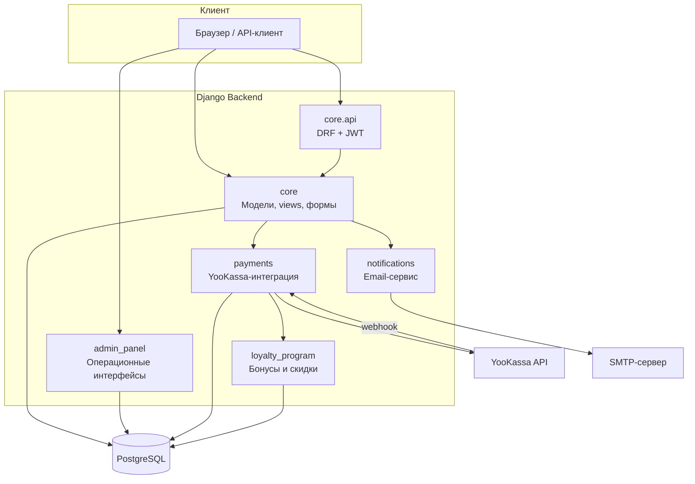

<details>
<summary>PlantUML-версия</summary>

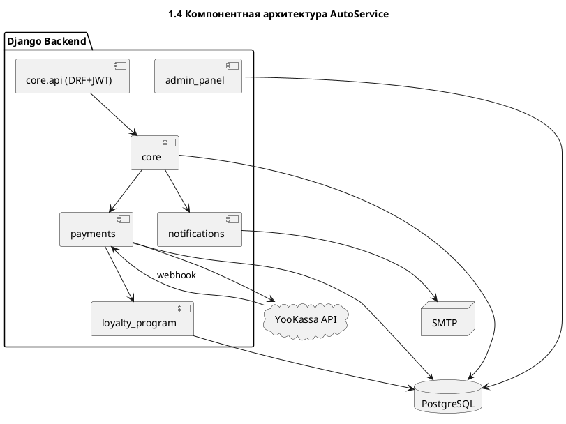

</details>

Ключевые архитектурные принципы:
- централизация бизнес-правил на backend-уровне.
- единая модель данных для пользовательского и административного разделов.
- разделение маршрутов и прав доступа между клиентскими и административными сценариями.
- адаптивность к развертыванию в разных окружениях за счет конфигурации через переменные среды.

С точки зрения взаимодействия подсистем архитектура реализует связку «запись → оплата → лояльность → уведомления». Модуль `core` выступает точкой координации жизненного цикла записи, `payments` отвечает за проведение и синхронизацию платежного статуса, `loyalty_program` встраивается в расчет итоговой стоимости, а `notifications` обеспечивает коммуникацию с пользователем при изменении состояния обслуживания.

### 1.5 Компоненты системы

#### 1.5.1 Компоненты слоя REST API

REST API реализован на DRF и обеспечивает программный доступ к ключевым сущностям системы, а также JWT-аутентификацию. Основная реализация этого слоя API выполнялась коллегой; в рамках данной работы API рассматривается как интеграционный слой, используемый для согласования веб-сценариев, прав доступа и общей архитектурной связности системы.

На уровне архитектуры для API зафиксированы единая маршрутизация через `DefaultRouter`, централизованные настройки безопасности и разделение пользовательских и административных endpoint-групп.

#### 1.5.2 Компоненты веб-клиента

В рамках данной работы реализован веб-клиент на серверном рендеринге Django templates. В этой части спроектированы и реализованы пользовательские сценарии, административные интерфейсы и согласование UI-логики с backend-ограничениями. Технически решение построено на Django view-функциях, серверных формах и встроенной валидации, что обеспечивает прямое соответствие интерфейсных операций доменным правилам системы.

Пользовательский раздел, реализованный автором, охватывает регистрацию и вход, профиль, управление автомобилями, запись на обслуживание, просмотр и отмену записей, а также динамические формы выбора филиала, услуги и доступного времени.

Административный раздел, реализованный автором, покрывает ежедневные операционные задачи: дашборд, управление филиалами и услугами, ведение пользователей и записей, обработку отзывов, а также контроль расписания через блокировку слотов. Отдельный акцент сделан на ролевом разграничении действий, чтобы административные операции были изолированы от клиентского раздела и выполнялись только в допустимых сценариях.

Компонентно веб-слой опирается на:
- URL-маршруты и view-функции для предметных сценариев;
- формы и встроенную валидацию на стороне сервера;
- ролевой контроль доступа для изоляции административных операций;
- AJAX-эндпоинты для динамических операций (например, доступные слоты и зависимые справочники).

Практический результат авторской реализации веб-части — целостная рабочая система для клиента и администратора, в которой ключевые бизнес-процессы (запись, изменение статусов, управление сущностями, коммуникация с пользователем) выполняются через единый серверный слой `views + forms + validation` без расхождения с backend-правилами.

### 1.6 Диаграммы взаимодействия (описание ключевых потоков)

#### 1.6.1 Сценарий «Запись на обслуживание»

Клиент формирует заявку через веб-форму или API-интерфейс, после чего система выполняет серверную валидацию входных данных, проверяет ограничения рабочего времени и отсутствие конфликтов по слоту. При успешной проверке создается запись, фиксируемая в общей доменной модели.

*Рисунок 1 — Последовательность взаимодействия при записи на обслуживание*

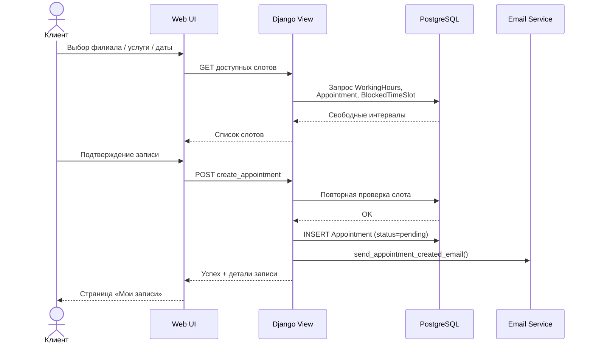

<details>
<summary>PlantUML-версия</summary>

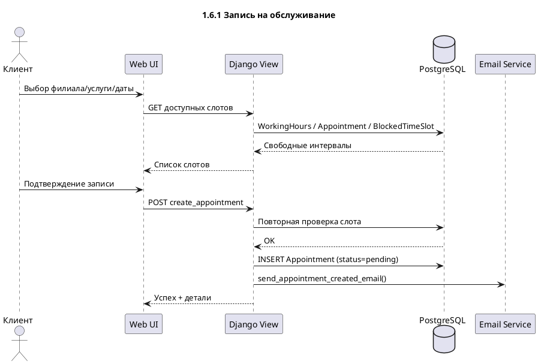

</details>

#### 1.6.2 Сценарий «Онлайн-оплата»

После инициирования оплаты формируется платежная сессия и выполняется редирект к платежному провайдеру. После возврата пользователя в систему статус платежа синхронизируется по запросу и через webhook-механизм, что обеспечивает согласованное состояние записи и платежа.

*Рисунок 2 — Последовательность взаимодействия при онлайн-оплате*

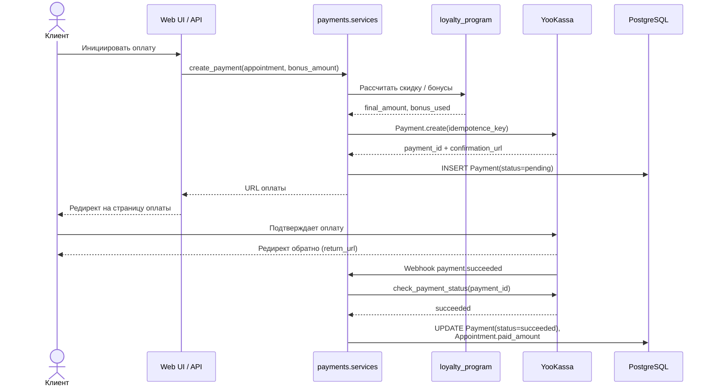

<details>
<summary>PlantUML-версия</summary>

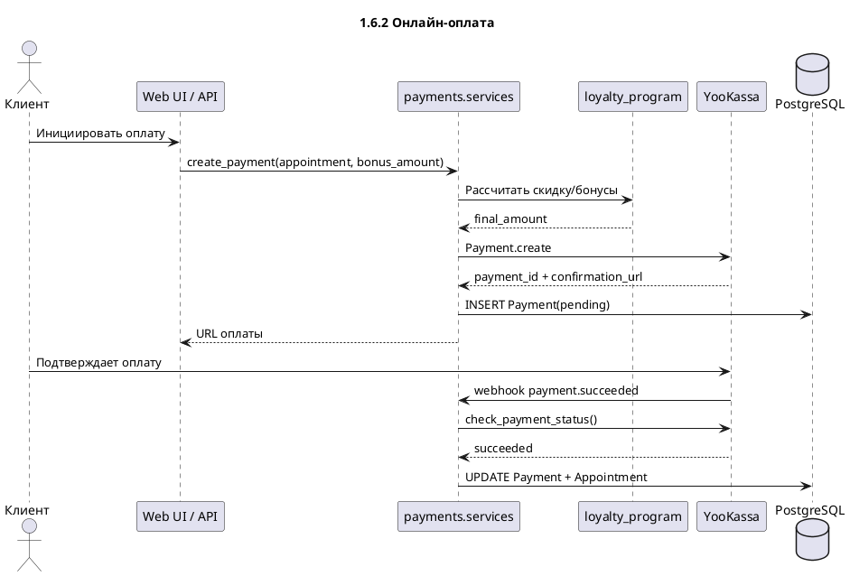

</details>

#### 1.6.3 Сценарий «Смена статуса записи администратором»

Администратор изменяет состояние записи через административный интерфейс или административный endpoint. Перед применением изменений выполняется проверка прав доступа, затем статус обновляется в доменной модели, а пользователю отправляется уведомление о результате операции.

*Рисунок 3 — Последовательность взаимодействия при смене статуса записи*

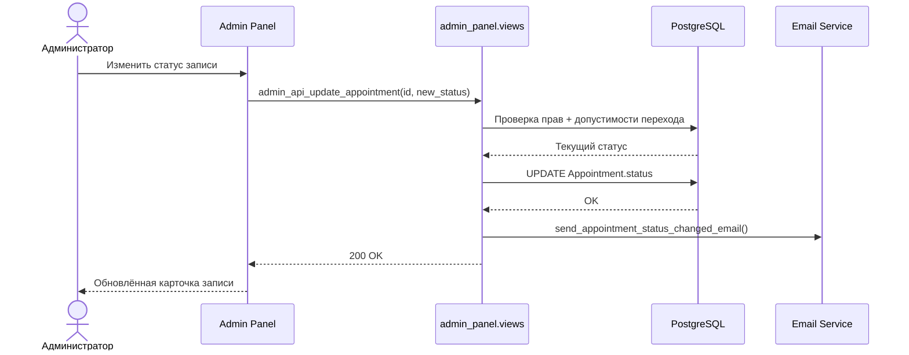

<details>
<summary>PlantUML-версия</summary>

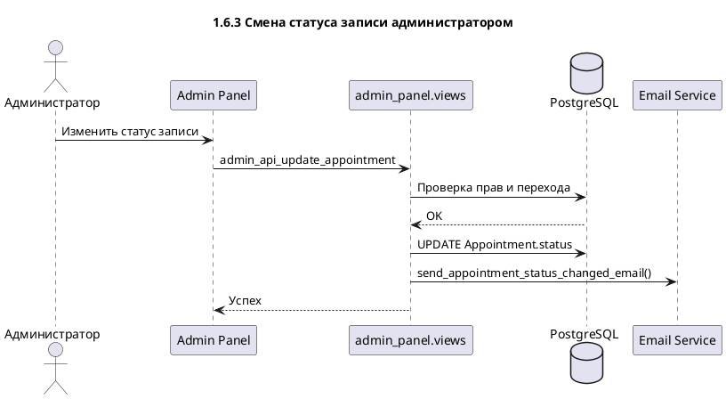

</details>

---

## 2 Практическая часть (результаты и обсуждение)

### 2.1 Структура реализации

#### 2.1.1 Структура серверной части

Серверная часть реализована на Django + DRF и объединяет модель данных для транспортных сущностей, расписания, услуг, записей, оплаты, лояльности и отзывов. Архитектурно сервер выступает единым источником правды для бизнес-правил и ограничений предметной области.

REST API в рамках проекта обеспечивает программный доступ к функциям системы и интеграционные сценарии; его основная реализация выполнялась коллегой и в данной работе рассматривается как необходимый инфраструктурный слой.

*Рисунок 5 — Диаграмма компонентов серверной части*

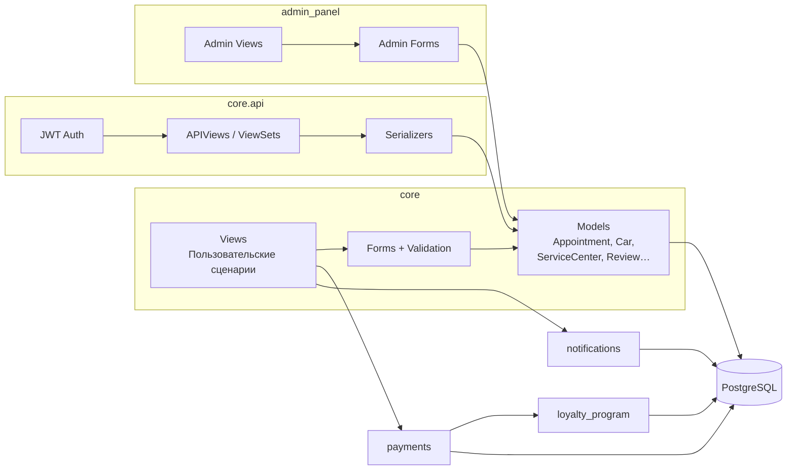

<details>
<summary>PlantUML-версия</summary>

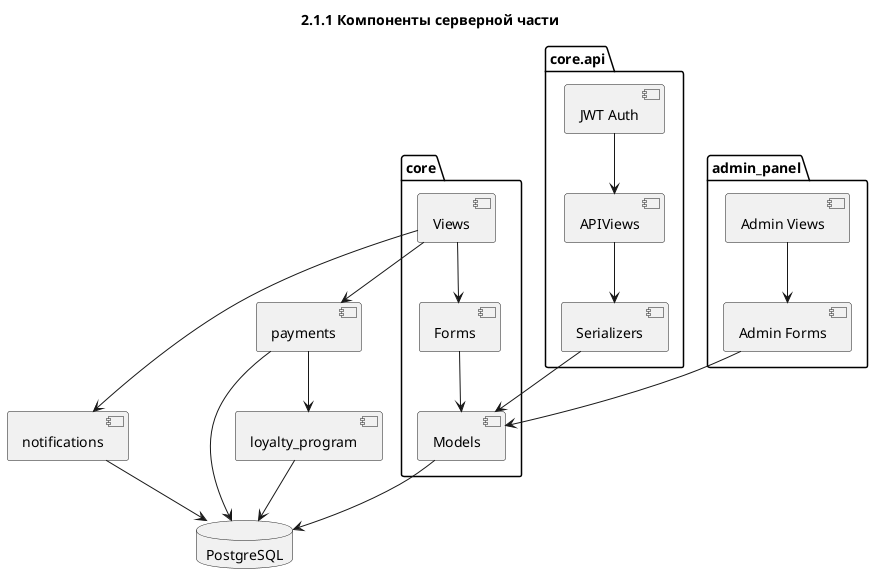

</details>

#### 2.1.2 Структура клиентской части

Клиентская часть представлена веб-интерфейсом для пользователей и административным интерфейсом для сотрудников сети. В рамках данной работы основной объем реализации сосредоточен именно в этой части: спроектированы прикладные пользовательские и административные сценарии, реализованы формы взаимодействия и обеспечено согласование интерфейсных действий с серверными правилами.

По объему реализации клиентская часть включает 60 view-функций (25 в `core`, 35 в `admin_panel`), 18 серверных форм (9 + 9) и 54 HTML-шаблона (29 + 25), что отражает полный охват пользовательских и административных сценариев.

Практический результат клиентской реализации — предсказуемые и устойчивые операционные потоки: запись на обслуживание, управление связанными сущностями, контроль статусов и снижение конфликтов в расписании за счет серверной валидации и ролевого доступа.

### 2.2 Реализация серверной части (Django backend)

Ключевая инженерная задача второй главы — показать, как бизнес-требования были переведены в устойчивую серверную реализацию, а не просто перечислить экраны интерфейса. В рамках проекта автором реализован полный цикл backend-работ: проектирование моделей и связей, серверная валидация, обработка пользовательских и административных сценариев, защита от неконсистентных состояний, а также поддержка операционной аналитики.

В проекте использована комбинация нескольких практик: централизация правил в формах и представлениях, явное разграничение ролей, предсказуемая обработка ошибок и защита критических операций от повторных/конкурентных действий. Такое решение позволило получить рабочую систему, которая ведет себя стабильно не только в «идеальном» пользовательском потоке, но и в пограничных случаях (ошибочные данные, просроченные записи, пересекающиеся интервалы, повторные запросы).

Отдельный акцент в реализации сделан на прослеживаемости принятых технических решений. Для каждой критичной бизнес-операции (создание записи, смена статуса, обработка оплаты, коммуникация с клиентом) выделены проверяемые входные условия, допустимые переходы состояния и ожидаемые выходные эффекты. Такой подход важен не только для текущей версии проекта, но и для его последующего развития: новая функциональность добавляется в систему с уже заданной инженерной рамкой, а не «поверх» неформализованного поведения.

Практически это означает, что backend в проекте выступает не пассивным слоем хранения данных, а активным управляющим уровнем предметной логики. Именно на сервере фиксируются ограничения по времени обслуживания, ролевые границы действий, правила консистентности и условия интеграционного взаимодействия. За счёт этого система остается предсказуемой при росте числа пользователей и при усложнении сценариев эксплуатации.

*Рисунок 6 — Диаграмма классов доменной модели*

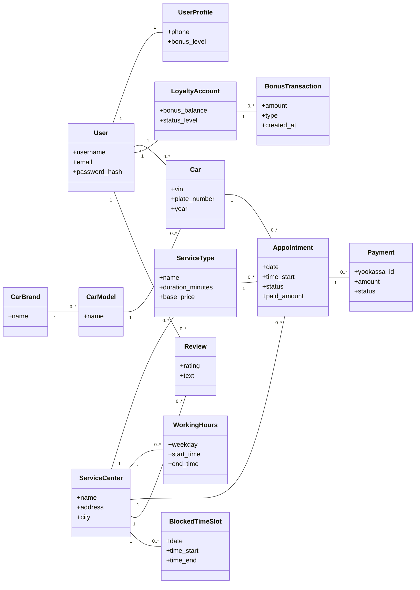

<details>
<summary>PlantUML-версия</summary>

```plantuml
@startuml
title 2.2 Доменная модель (ключевые сущности)
class User
class UserProfile { phone; bonus_level }
class Car { vin; plate_number; year }
class CarBrand { name }
class CarModel { name }
class ServiceCenter { name; address; city }
class ServiceType { name; duration_minutes; base_price }
class WorkingHours { weekday; start_time; end_time }
class Appointment { date; time_start; status; paid_amount }
class Payment { yookassa_id; amount; status }
class LoyaltyAccount { bonus_balance; status_level }
class BonusTransaction { amount; type }
class Review { rating; text }
class BlockedTimeSlot { date; time_start; time_end }

User "1" -- "1" UserProfile
User "1" -- "0..*" Car
CarBrand "1" -- "0..*" CarModel
CarModel "1" -- "0..*" Car
ServiceCenter "1" -- "0..*" ServiceType
ServiceCenter "1" -- "0..*" WorkingHours
ServiceCenter "1" -- "0..*" Appointment
ServiceCenter "1" -- "0..*" Review
ServiceCenter "1" -- "0..*" BlockedTimeSlot
ServiceType "1" -- "0..*" Appointment
Car "1" -- "0..*" Appointment
Appointment "1" -- "0..*" Payment
User "1" -- "1" LoyaltyAccount
LoyaltyAccount "1" -- "0..*" BonusTransaction
User "1" -- "0..*" Review
@enduml
```

</details>

#### 2.2.1 Серверные формы и многоуровневая валидация

Основной слой прикладных ограничений реализован в `core/forms.py`. Формы выполняют не только проверку обязательных полей, но и доменную валидацию: соответствие графику филиала, недопустимость записи в прошлое, контроль пересечений по времени, проверку корректности идентификаторов автомобиля и согласованности связанных сущностей.

Компактный фрагмент кода проверки записи (реализовано в `AppointmentForm.clean`):

```python
# импорт: from datetime import date
if scheduled_date < date.today():
    raise ValidationError("Нельзя записаться на прошедшую дату.")

conflicting_appointments = Appointment.objects.filter(
    scheduled_date=scheduled_date,
    status__in=["SCHEDULED", "IN_PROGRESS"],
    service_center=service_center,
    scheduled_time__lt=end_time_obj,
    end_time__gt=start_time_obj,
)
if conflicting_appointments.exists():
    raise ValidationError("Выбранное время уже занято.")
```

Проверка пересечения реализована по правилу overlap в форме сравнения «существующая запись vs новый интервал»: конфликт есть, если `existing_start < new_end` и одновременно `existing_end > new_start`.

Такой подход демонстрирует владение не только Django-формами как инструментом, но и умение формализовать бизнес-ограничения в явных, проверяемых правилах. За счёт этого критичные проверки не зависят от клиентского JavaScript и выполняются единообразно для всех точек входа.

С инженерной точки зрения многоуровневая валидация также снижает стоимость сопровождения: локальные изменения интерфейса не требуют переработки доменных ограничений, а регрессионные эффекты проще выявляются в тестах. Кроме того, концентрация ключевых проверок в серверном слое позволяет использовать их повторно в разных сценариях (веб-формы, административные операции, API-потоки), сохраняя единое поведение системы.

#### 2.2.2 Пользовательские Django views и обработка бизнес-сценариев

Пользовательские сценарии реализованы через function-based views в `core/views.py` с обязательной авторизацией для операций, работающих с персональными данными и записями. Внутри представлений автором реализованы: выборки с `select_related/prefetch_related`, обработка ветвлений GET/POST, возврат HTML или JSON для динамических интерфейсов, и безопасная передача сообщений об ошибках.

Важно, что backend-часть не ограничивается CRUD-операциями. В представлениях реализованы прикладные вычисления (например, формирование агрегатов для личного кабинета), а также согласование пользовательских действий с текущим состоянием доменной модели. Это показывает компетенции в проектировании «живой» серверной логики, а не только в шаблонной связке модели и формы.

Дополнительно в пользовательских представлениях решена задача управляемой деградации поведения: при ошибках валидации, ограничениях БД или некорректных входных параметрах пользователь получает интерпретируемую обратную связь, а не необработанные технические исключения. В контексте эксплуатационной разработки это критично, поскольку качество пользовательского опыта напрямую зависит от того, насколько система «объясняет» причину отказа и предлагает корректный следующий шаг.

#### 2.2.3 Административный backend: контроль процессов и операционная аналитика

Административные операции реализованы в `admin_panel/views.py` и изолированы декораторами `@login_required` и `@admin_required`. В этой части системы автором реализованы функции, которые непосредственно поддерживают ежедневную работу сервиса: фильтрация по множеству критериев, поиск, пагинация, массовая обработка статусов и вычисление KPI.

Пример прикладной серверной автоматизации (автоотмена просроченных записей):

```python
# today/now_time/now вычисляются выше через timezone.localtime(timezone.now())
Appointment.objects.filter(status="SCHEDULED").filter(
    (Q(scheduled_date__lt=today) | Q(scheduled_date=today, end_time__lte=now_time))
).update(status="CANCELLED", updated_at=now)
```

В полном коде `today`, `now_time` и `now` вычисляются в начале функции `_auto_cancel_overdue_appointments` в `admin_panel/views.py` через `timezone.localtime(timezone.now())`, что обеспечивает корректную привязку к текущему моменту.

Наличие таких операций в backend подтверждает, что автор решал задачу операционной устойчивости: система сама поддерживает корректность жизненного цикла записи, а не перекладывает контроль на ручные действия сотрудников.

Также в административной части реализован подход «данные как основа решения»: интерфейс управления опирается на актуальные агрегаты, фильтры и статусные выборки, а не на статические отчеты. Это помогает руководителю смены и администратору принимать решения в реальном времени — перераспределять загрузку, оперативно находить проблемные записи и контролировать динамику обслуживания по филиалам.

#### 2.2.4 Устойчивость backend-логики и прикладные приёмы

В серверной части применены решения, повышающие надежность в эксплуатации:

- проверка ограничений на нескольких уровнях (форма, представление, модель);
- явные статусные переходы и запрет недопустимых действий;
- обработка ошибок с понятной обратной связью для пользователя;
- подготовка данных для аналитических экранов напрямую на уровне запросов ORM;
- переиспользуемые фрагменты логики (например, служебные функции для актуализации состояния записей).

В совокупности это демонстрирует компетенции автора в практической backend-разработке: от доменного анализа до реализации устойчивой логики в реальном проекте.

#### 2.2.5 Работа с данными и сопровождаемость решения

Отдельным инженерным результатом является организация слоя доступа к данным. В проекте активно применяются ORM-приёмы (`select_related`, `prefetch_related`, агрегации и аннотации), которые уменьшают число избыточных запросов и делают поведение представлений масштабируемым. Для административных страниц с фильтрацией и поиском это особенно важно: без оптимизации запросов даже корректная функционально логика быстро теряет эксплуатационную ценность при росте объёма данных.

С точки зрения сопровождения полезным решением стало выделение повторяющихся служебных операций в отдельные функции и унификация обработчиков типовых сценариев. Это снижает дублирование, упрощает ревью изменений и делает кодовую базу более предсказуемой для командной разработки. В результате проект демонстрирует не только реализацию требований, но и готовность к эволюции: систему можно расширять без лавинообразного роста технического долга.

### 2.3 Реализация интеграций и прикладных сервисов

Раздел интеграций демонстрирует работу с внешними и внутренними сервисами как с единым инженерным процессом: проектирование интерфейсов, контроль согласованности данных, снижение рисков повторных операций и обеспечение наблюдаемости выполнения. В проекте это реализовано через отдельные модули `payments`, `notifications` и `loyalty_program`, которые связаны с ядром системы, но не смешивают свою ответственность с веб-представлениями.

Такое разделение имеет принципиальное значение для качества архитектуры. Прикладной слой получает понятные сервисные точки входа, а интеграционный код изолируется от UI-деталей и локальной специфики отдельных страниц. Благодаря этому изменения в одном подсервисе (например, правила начисления бонусов или политика отправки уведомлений) не требуют каскадной переработки всей системы и могут выполняться итеративно, с контролируемым риском.

#### 2.3.1 Платёжная интеграция (YooKassa)

Платёжная логика вынесена в `payments/services.py`, где реализованы создание платежа, проверка статуса и обработка отказов. Ключевое решение — идемпотентность создания: при повторном запросе по той же записи возвращается уже существующий `pending`-платеж.

Компактный фрагмент кода:

```python
existing_payment = Payment.objects.filter(
    appointment=appointment, status="pending"
).first()
if existing_payment:
    return existing_payment

yoo_payment = YooPayment.create(payment_data)
```

Такой подход устраняет дубли финансовых операций и снижает риск рассогласования между локальной БД и внешним провайдером. Дополнительно автором реализована двойная синхронизация статуса: по пользовательскому действию и через webhook-события.

Практическая ценность такого решения проявляется в реальных эксплуатационных ситуациях: нестабильная сеть, повторный клик пользователя по кнопке оплаты, задержка ответа от внешнего провайдера, асинхронная доставка webhook-событий. При наличии идемпотентной модели и независимых каналов подтверждения статуса система сохраняет корректность финансового состояния и не создает дублей платежных сущностей.

#### 2.3.2 Уведомления и коммуникации

Подсистема уведомлений реализована в `notifications/email_service.py` как отдельный сервис с шаблонами писем и асинхронной отправкой в фоновом потоке. Это архитектурно важное решение: сетевые задержки email-провайдера не блокируют интерфейсные операции и не ухудшают отклик пользовательских страниц.

Компактный фрагмент кода:

```python
def _send_async(subject, recipients, text, html):
    from_email = settings.DEFAULT_FROM_EMAIL
    def _runner():
        send_mail(subject, text, from_email, list(recipients), html_message=html)
    threading.Thread(target=_runner, daemon=True).start()
```

С инженерной точки зрения здесь показано умение проектировать сервисы коммуникации с учетом эксплуатационных требований: отказоустойчивость, логирование, переиспользуемые шаблоны и разделение пользовательских/административных уведомлений.

Дополнительно реализованный подход улучшает управляемость коммуникаций: все ключевые уведомления формируются централизованно, что позволяет единообразно контролировать формат сообщений, состав контекста и список получателей. Для проекта это важно не только как удобство, но и как элемент качества сервиса: предсказуемая коммуникация снижает нагрузку на поддержку и повышает прозрачность взаимодействия с клиентом.

Важно отметить, что текущая реализация уже включает обработку исключений и логирование ошибок в сервисе уведомлений, поэтому сбои не остаются полностью «тихими». При дальнейшем промышленном масштабировании целесообразно вынести отправку сообщений в специализированную очередь фоновых задач (например, Celery/RQ), чтобы повысить управляемость ретраев и наблюдаемость почтовых операций.

#### 2.3.3 Программа лояльности

Подсистема лояльности в `loyalty_program` реализует самостоятельную бизнес-логику: хранение баланса бонусов, пересчёт клиентского статуса по порогам, расчет доступной скидки и фиксацию транзакций начисления/списания. Важный момент — изменения состояния оформлены как явные доменные операции, что повышает прозрачность и тестируемость.

Компактный фрагмент кода:

```python
def spend_bonuses(self, amount: Decimal, description: str = ""):
    if amount <= 0 or amount > self.bonus_balance:
        return False
    self.bonus_balance -= amount
    self.save()
    BonusTransaction.objects.create(...)
    return True
```

Связка модуля лояльности с оплатой реализована так, чтобы бонусные операции выполнялись только при корректных статусах платежа и не дублировались при повторной обработке событий. Это показывает владение автором задачами согласования нескольких подсистем в едином жизненном цикле заказа.

С точки зрения продуктовой логики программа лояльности встроена не как «надстройка», а как полноценный механизм управления повторными обращениями и удержанием клиента. Техническая реализация поддерживает прозрачный аудит бонусных операций (начисление, списание, изменение статуса), что важно для анализа пользовательского поведения и последующей настройки маркетинговых правил.

Для сценариев с повышенной конкуренцией запросов (высокая параллельная нагрузка) дополнительным направлением развития является усиление атомарности операций списания/начисления на уровне транзакций БД (например, через `transaction.atomic()` и блокировки строки аккаунта). Такая доработка логично продолжает выбранный в проекте курс на эксплуатационную устойчивость многопользовательских операций.

#### 2.3.4 Сквозная устойчивость интеграционного потока

Важным результатом раздела интеграций является реализация сквозного потока «запись → оплата → изменение состояния → уведомление → лояльность» как управляемой последовательности согласованных шагов. В такой последовательности каждый этап опирается на проверяемое состояние предыдущего и формирует явный результат для следующего. Это снижает вероятность «тихих» ошибок, когда подсистемы расходятся в интерпретации текущего статуса операции.

С инженерной позиции это демонстрирует умение автора строить не только отдельные сервисы, но и их корректное взаимодействие в составе единого бизнес-процесса. При развитии системы такая архитектура позволяет добавлять новые интеграции (например, внешнюю CRM или push-канал уведомлений) без разрушения уже работающих механизмов, поскольку базовый принцип согласованности состояний и ответственности модулей уже реализован на уровне проектных решений.

*Рисунок 7 — Сквозной интеграционный поток: запись → оплата → лояльность → уведомление*

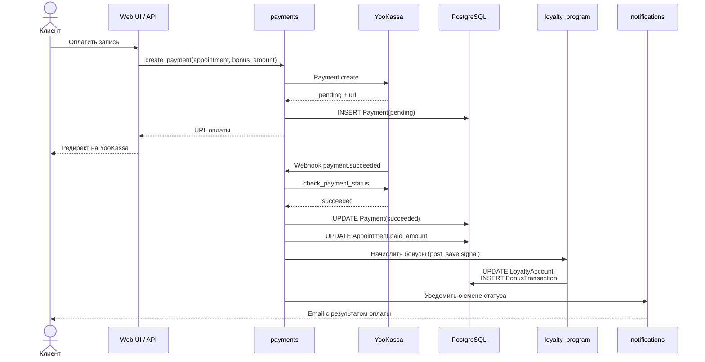

<details>
<summary>PlantUML-версия</summary>

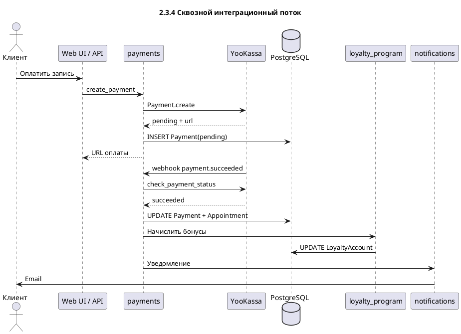

</details>

### 2.4 Развертывание системы

#### 2.4.1 Подготовка окружения и запуск

Развертывание реализовано в двух режимах: локальный запуск для разработки и контейнерный запуск для стабильного окружения. В обоих случаях ключевым элементом является конфигурация через переменные окружения (`.env`), что позволяет отделить код от параметров инфраструктуры (БД, секреты, адреса сервисов).

В локальном режиме базовый сценарий включает установку зависимостей, применение миграций и заполнение начальных справочников (`fill_car_data`, `seed_data`). После этого приложение запускается стандартным сервером Django. Такой режим удобен для разработки, отладки бизнес-логики и демонстрации функционала.

В контейнерном режиме используется связка из трёх сервисов: `web` (Django + Gunicorn), `db` (PostgreSQL 16) и `caddy` (обратный прокси и отдача статических/медиа-файлов). В `docker-compose.yml` предусмотрены healthcheck для базы данных, перезапуск контейнеров при сбоях и отдельные тома для данных БД, статики и медиа. Это обеспечивает воспроизводимое развертывание и повышает эксплуатационную устойчивость.

Производственный процесс дополняется CI-процессом сборки Docker-образа (`docker-image-artifact.yml`) и проверками запуска приложения в Ubuntu/Windows workflow. Таким образом, развертывание опирается не только на ручной сценарий, но и на автоматизированную верификацию работоспособности.

#### 2.4.2 Состав сервисов и роль каждого компонента

В работающем контуре развертывания каждый сервис выполняет отдельную, явно ограниченную роль. Сервис `web` отвечает за исполнение прикладной логики: обработку HTTP-запросов, серверную валидацию, работу доменных модулей (`core`, `payments`, `notifications`, `loyalty_program`) и формирование ответов для пользовательского и административного интерфейсов. Сервис `db` выступает единой точкой хранения состояния системы: пользователей, записей, статусов, платежных сущностей и бонусных операций. Сервис `caddy` обеспечивает внешний входной контур: принимает клиентские запросы, проксирует динамические обращения к `web`, а статические и медиа-ресурсы отдает напрямую.

Такое разделение обязанностей имеет практический эффект для эксплуатации. База данных изолирована от внешнего прямого доступа, прикладной код не смешивается с функциями обратного прокси, а управление HTTP-трафиком и выдачей файлов вынесено в отдельный инфраструктурный слой. В результате система проще масштабируется и сопровождается: изменения на уровне веб-сервера, БД или reverse-proxy можно выполнять поэтапно, не нарушая границы ответственности.

*Рисунок 8 — Диаграмма Docker-контейнеров и их взаимодействия*

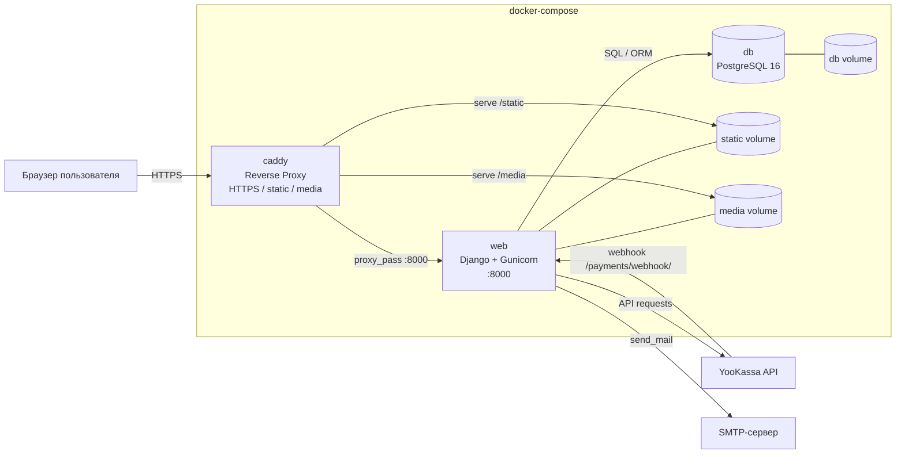

<details>
<summary>PlantUML-версия</summary>

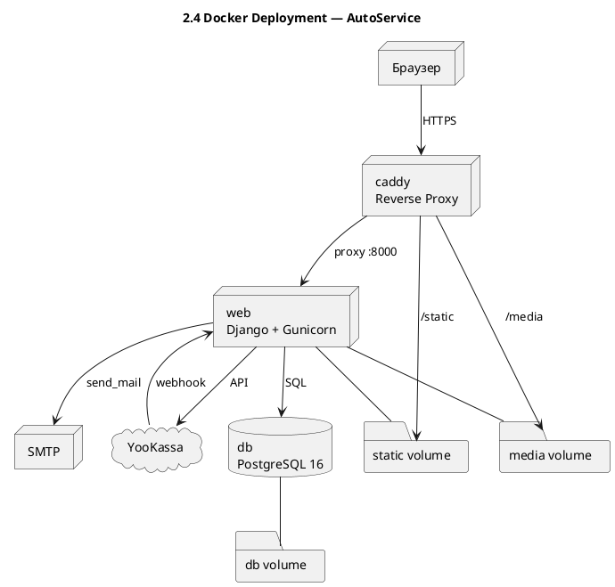

</details>

Отдельную роль играет работа с постоянными данными через Docker-тома. Данные PostgreSQL, а также статические и медиа-файлы не теряются при перезапуске контейнеров, что критично для реального использования и воспроизводимых обновлений. Таким образом, архитектура развертывания поддерживает не только запуск приложения, но и его жизненный цикл в длительной эксплуатации.

#### 2.4.3 Взаимодействие сервисов в рабочем потоке

Сквозной инфраструктурный маршрут можно описать как последовательность: клиентское устройство → `caddy` → `web` → `db` → обратный ответ пользователю. Когда пользователь открывает страницу или выполняет действие (например, запись на обслуживание), запрос сначала попадает в `caddy`, затем передается в `web`, где применяются бизнес-правила и выполняются ORM-запросы к `db`. После фиксации результата в базе приложение формирует ответ, который возвращается тем же маршрутом через reverse-proxy.

Для статического контента и медиа путь отличается: `caddy` обслуживает эти ресурсы без участия прикладного Python-процесса, что снижает нагрузку на `web` и улучшает отклик интерфейса. Для динамических сценариев (формы, фильтрация, смена статусов, интеграции оплаты и лояльности) ключевым остается контур `caddy` → `web` → `db`, где обеспечивается консистентность данных и контролируемая обработка ошибок.

С инженерной точки зрения важно, что в проекте предусмотрены базовые механизмы эксплуатационной устойчивости: проверки доступности базы, политика перезапуска сервисов, а также автоматизированные CI-проверки контейнерной сборки и запуска. Это уменьшает риск «ручных» регрессий при обновлениях и делает процесс поставки более предсказуемым.

### 2.5 Тестирование

#### 2.5.1 Функциональное тестирование

Функциональные проверки охватывают пользовательские сценарии и основные административные операции: регистрацию и вход, работу с профилем, управление автомобилями, создание/отмену записи, а также ролевой доступ к административным страницам. Цель этого слоя — подтвердить корректность поведения системы с точки зрения бизнес-сценариев конечного пользователя.

Отдельное внимание уделяется валидационным ограничениям: недопустимые даты записи, конфликты по времени, ограничения статусов и корректность обработки ошибок формы. Такие проверки снижают риск регрессий в критичных операциях.

Практическая ценность функционального слоя заключается в том, что он проверяет не отдельные строки кода, а наблюдаемое поведение системы в прикладных сценариях. Это позволяет фиксировать соответствие реализации бизнес-требованиям и быстро выявлять регрессии после изменений в представлениях, формах и шаблонах. Для проекта с выраженным ролевым разделением (клиент/администратор) такой уровень тестирования является базовым инструментом контроля качества.

#### 2.5.2 Интеграционное тестирование

Интеграционный слой проверяет связность модулей и корректность сквозных процессов: «запись → оплата → обновление статуса → бонусная логика». На этом уровне валидируется обмен данными между `core`, `payments`, `loyalty_program`, а также стабильность переходов состояний сущностей.

Дополнительно в CI workflow выполняются миграции, сбор статики и запуск тестов на разных платформах (Ubuntu и Windows), что снижает риск платформенно-зависимых ошибок.

В отличие от функциональных тестов, интеграционные проверки подтверждают, что подсистемы корректно взаимодействуют именно в цепочке событий, а не в изоляции. Это особенно важно для проекта, где итоговое пользовательское действие затрагивает несколько доменных областей (расписание, платежи, уведомления, лояльность). За счет такого уровня контроля снижается вероятность рассогласований состояния между модулями при реальной эксплуатации.

#### 2.5.3 Нагрузочное и производительное тестирование

В файле `tests_performance.py` реализованы прикладные performance-сценарии: одновременные логины и обращения к профилю, проверка времени отклика страниц, а также скорость выборок/поиска при увеличенном объёме данных. В тестах зафиксированы пороговые значения, что позволяет отслеживать деградацию производительности при изменениях в коде.

Базовая команда верификации проекта — `python manage.py test`. Для ускорения в CI используется запуск с `--keepdb`, который повторно использует тестовую БД между прогонами и сокращает время на её подготовку; при изменениях истории миграций или при необходимости полностью «чистого» прогона предпочтителен запуск без `--keepdb`.

Нагрузочные сценарии в данном контексте выступают как ранний индикатор эксплуатационных рисков: даже при корректной функциональности система может деградировать по времени ответа при росте числа одновременных обращений. Фиксация порогов и регулярный запуск этих проверок позволяют контролировать производительность на уровне, достаточном для пилотной и дальнейшей промышленной эксплуатации.

#### 2.5.4 Связность уровней тестирования и критерии готовности

С инженерной точки зрения тестирование в проекте организовано как взаимодополняющая система. Функциональные проверки подтверждают корректность пользовательских действий, интеграционные — согласованность межмодульных процессов, производительные — устойчивость отклика и работы под нагрузкой. Только совместное прохождение этих уровней даёт обоснованное основание считать изменение безопасным для внедрения.

Критерий готовности релиза в рамках проекта формируется не одной метрикой, а совокупностью сигналов: успешный прогон `python manage.py test`, отсутствие критичных регрессий по бизнес-сценариям, сохранение консистентных статусных переходов и приемлемые показатели времени отклика в performance-проверках. Такой подход соответствует задаче разработки эксплуатационно ориентированной системы, а не только демонстрационного прототипа.

### 2.6 Апробация и внедрение

#### 2.6.1 Руководство пользователя (эксплуатационный минимум)

Под эксплуатационным минимумом в рамках данной работы понимается обязательный набор действий, достаточный для повседневного использования системы без ручных обходных процедур. Этот минимум разделён на два базовых раздела.

Клиентский раздел:
- регистрация и авторизация в системе;
- заполнение профиля и добавление автомобиля;
- выбор филиала, услуги, даты и времени;
- подтверждение записи и, при необходимости, онлайн-оплата;
- отслеживание статуса записи и получение уведомлений.

Административный раздел:
- вход в защищённый backend;
- просмотр и фильтрация записей по филиалам/статусам/клиентам;
- корректировка статусов обслуживания;
- управление доступностью временных интервалов;
- контроль операционных показателей на дашборде.

Такое разделение ролей обеспечивает прозрачность процессов и снижает число ошибок при повседневной эксплуатации.

#### 2.6.2 Результаты апробации

Апробация показала работоспособность ключевых бизнес-сценариев: от регистрации клиента до завершения обслуживания с фиксацией статуса и платежа. Проверки подтвердили устойчивость основных пользовательских и административных потоков, а также корректность межмодульного взаимодействия (запись, платежи, уведомления, лояльность).

Важным результатом является предсказуемость операционного маршрута: система минимизирует конфликтные ситуации в расписании, поддерживает управляемую обработку ошибок и сохраняет консистентность данных при повторных действиях пользователя. Это позволяет использовать разработанное решение как рабочую основу для пилотной эксплуатации.

С практической точки зрения апробация подтвердила, что разработка может использоваться не только в демонстрационном режиме, но и как инструмент операционного управления повседневной загрузкой филиалов. Ключевой эффект состоит в снижении доли ручных согласований и в повышении прозрачности статусов обслуживания для всех ролей системы.

#### 2.6.3 Ограничения и дальнейшее развитие

К текущим ограничениям относятся: ограниченный объём продуктовой статистики в административной аналитике, отсутствие специализированного мобильного клиента и необходимость дальнейшего расширения автоматизированных проверок отдельных модулей на уровне unit-тестов.

Приоритетные направления развития:
- углубление аналитического блока (воронка записи, загрузка филиалов, показатели SLA);
- развитие многоканального клиентского взаимодействия (мобильный интерфейс, push-уведомления);
- интеграция с внешними корпоративными системами (CRM/ERP/финансовые системы);
- усиление тестового покрытия для критичных бизнес-правил и сценариев отказоустойчивости.

Указанные ограничения не снижают прикладной ценности текущей версии, но определяют последовательность инженерного развития: сначала расширение наблюдаемости и аналитики, затем рост каналов клиентского взаимодействия и глубины интеграций. Такой порядок позволяет масштабировать решение без отказа от уже реализованных бизнес-процессов.

#### 2.6.4 Итоги главы 2

Вторая глава продемонстрировала полный цикл прикладной реализации: от проектных решений и модульной архитектуры до эксплуатационного развертывания, проверки качества и апробации в ключевых сценариях. В совокупности это подтверждает, что система построена как целостный продукт с управляемыми границами ответственности, а не как набор несвязанных функций.

Итоговым результатом главы является доказанная технологическая и эксплуатационная состоятельность решения: сервисы корректно взаимодействуют в общем контуре, критичные бизнес-правила контролируются на уровне backend-валидаций, а тестовый контур обеспечивает раннее выявление регрессий. Это формирует обоснованный переход к заключению и фиксации итогов всей ВКР.

---

## Заключение

В рамках ВКР достигнута поставленная цель: разработана и апробирована веб-система, автоматизирующая ключевые процессы сети автосервисов — от регистрации пользователя и планирования визита до сопровождения статуса работ, оплаты и управленческого контроля.

Главный практический результат работы состоит в том, что реализовано не демонстрационное приложение, а эксплуатационно ориентированное решение с реальными ограничениями предметной области. В системе обеспечены ролевой доступ, серверная валидация критичных правил, защита от конфликтов расписания, управление статусами обслуживания, интеграция с платежным провайдером, почтовые уведомления и программа лояльности.

Ключевая инженерная ценность выполненной работы заключается в согласованности архитектурных и эксплуатационных решений. Развертывание организовано через воспроизводимый контейнерный контур, межмодульные взаимодействия реализованы как управляемые сценарии с явными переходами состояний, а контроль качества поддержан многоуровневым тестированием и CI-проверками. Это обеспечивает предсказуемое поведение системы при развитии функциональности и снижает риск критичных регрессий при сопровождении.

С инженерной точки зрения работа демонстрирует комплекс компетенций разработчика:
- декомпозиция предметной области на независимые модули и проектирование их взаимодействия;
- реализация backend-логики с учетом бизнес-ограничений, а не только базовых CRUD-операций;
- построение пользовательского и административного разделов с явным разграничением прав;
- интеграция внешних сервисов с контролем идемпотентности и консистентности данных;
- применение функциональных, интеграционных и производительных тестов;
- подготовка проекта к воспроизводимому развертыванию в контейнерной инфраструктуре.

Отдельно подтверждена прикладная состоятельность решения: в ходе апробации система показала предсказуемое поведение в основных пользовательских и административных сценариях, корректную обработку ошибок и устойчивость межмодульных процессов. Это позволяет рассматривать разработку как основу для пилотного внедрения и дальнейшего масштабирования.

Перспективы развития связаны с углублением аналитического блока, расширением многоканального клиентского взаимодействия (включая мобильные интерфейсы), интеграцией с корпоративными системами и усилением автоматизированного контроля качества.

Таким образом, полученные результаты обладают не только академической, но и прикладной значимостью: созданная система уже покрывает критичный контур операционной деятельности автосервисной сети и может служить платформой для последующего продуктового роста. Последовательное развитие аналитики, интеграций и каналов взаимодействия позволит повысить управляемость бизнеса без пересмотра базовой архитектурной модели.

Итоговый вывод: выполненная работа подтверждает, что разработанная система соответствует цели ВКР, решает ключевые прикладные задачи автосервисной сети и демонстрирует сформированные инженерные компетенции автора в проектировании, реализации и сопровождении современного веб-приложения.
